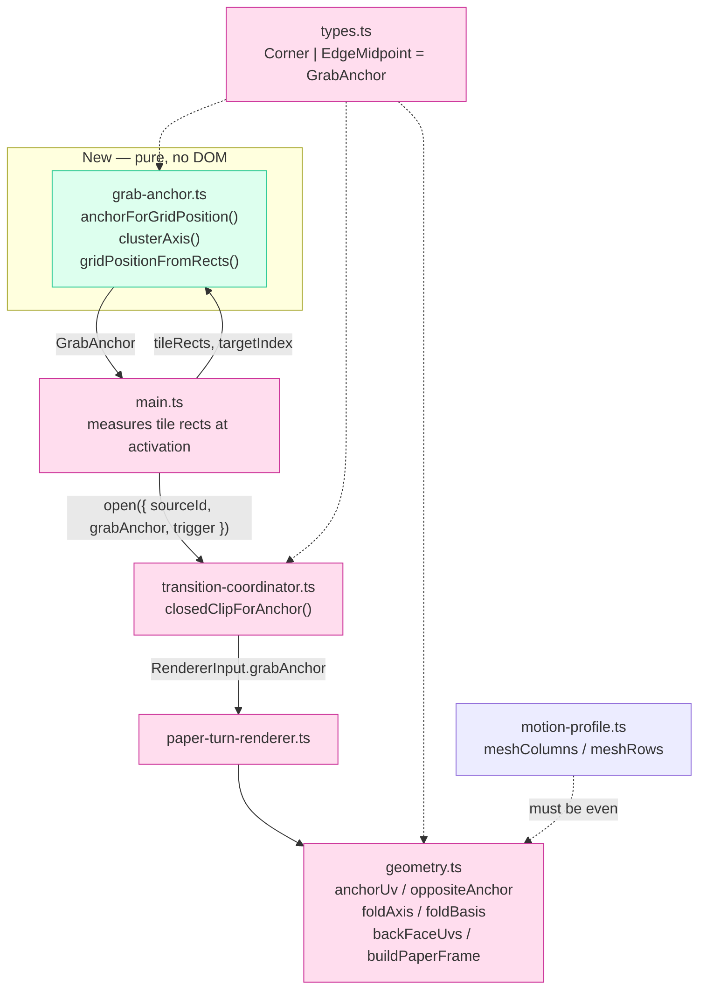
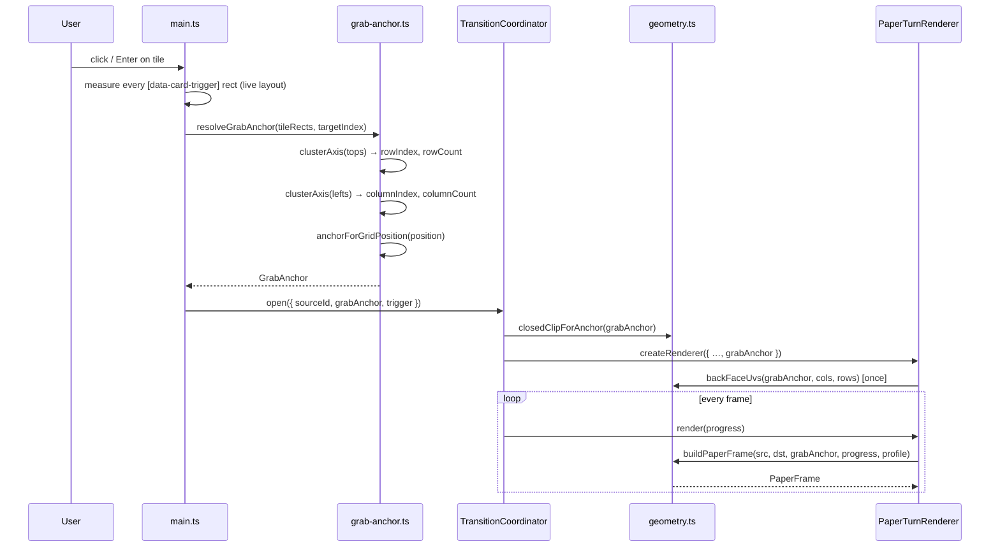

# Design Document: Position-Based Grab Anchor

**Status:** Draft
**Target codebase:** `spectrum-paper-turn-prototype`
**Design contract:** [`docs/superpowers/specs/2026-08-27-spectrum-paper-turn-design.md`](../../../docs/superpowers/specs/2026-08-27-spectrum-paper-turn-design.md)
**Architecture notes:** [`docs/architecture.md`](../../../docs/architecture.md)
**Notation:** TypeScript. The change modifies named `.ts` modules in an existing
TypeScript codebase, so code sections use the language the design must integrate with
rather than pseudocode. Algorithms are additionally stated in `pascal`-style
pseudocode where the formal specification matters more than the syntax.

---

## Overview

Today the turning sheet's grab point is a per-trigger authoring decision: `main.ts`
reads `data-grabbed-corner` off the activated card and falls back to `top-right`. Every
tile in the grid therefore turns the same way regardless of where it sits, which reads
as an arbitrary flourish rather than as a physical response to the tile the user
touched.

This design derives the grab point from the tile's **live position in the grid** at
activation time. A tile on the left edge is grabbed from its left side, a tile on the
top row from its top, a centered tile from its top edge midpoint. The pivot is always
the geometric opposite of the grab point, so the sheet still turns as one coherent
half-rotation of a growing rectangle.

Two structural consequences follow. First, the anchor set grows from 4 corners to 8:
the four corners plus the four edge midpoints. Second, the fold axis is no longer
always a diagonal — edge-midpoint anchors fold about a **midline**, which is a second,
orthogonal axis family, not a parameterization of the diagonal case. Everything the
existing design contract guarantees about the motion is preserved; only the axis
selection and the anchor vocabulary widen.

---

## Architecture

### Shape of the change



| Module | Change |
| --- | --- |
| `grab-anchor.ts` *(new)* | Pure grid-position → anchor resolution and rect clustering. No DOM, no time. |
| `types.ts` | `Corner` narrows to its true meaning (rect corner); adds `EdgeMidpoint` and `GrabAnchor`. Public fields rename `grabbedCorner` → `grabAnchor`. |
| `geometry.ts` | 8-anchor tables, two fold-axis families, basis-driven reveal sweep, even-mesh validation. |
| `transition-coordinator.ts` | `closedClipForCorner()` switch replaced by a table-driven `closedClipForAnchor()`. |
| `paper-turn-renderer.ts` | Field rename; publishes the resolved anchor on the overlay for diagnostics. |
| `main.ts` | `DEFAULT_CORNER` / `resolveGrabbedCorner()` deleted; measures tile rects and resolves the anchor at activation. |
| `motion-profile.ts` | Unchanged values (20 × 14, both already even); documented as constrained to even. |

The layering rule from `docs/architecture.md` holds: `geometry.ts` and `grab-anchor.ts`
are pure functions, and the only layout reads happen in `main.ts` before the first
animation frame.

### Activation sequence



Resolution happens **once per activation**, from measured layout, so the anchor tracks
responsive breakpoints without any authoring. The grid in this prototype is
`repeat(auto-fit, minmax(min(100%, 240px), 1fr))`, which collapses to a single column
under the mobile media query — column and row counts genuinely change with viewport
width, which is why the anchor cannot be locked in at authoring time.

A resize *during* a turn already invalidates the measured geometry and settles through
the fallback (existing contract behavior), so there is no mid-turn re-resolution path.

---

## Components and Interfaces

Seven modules participate. Two are pure (`grab-anchor.ts`, `geometry.ts`), one is types
only (`types.ts`), one is constants only (`motion-profile.ts`), and the remaining three
own DOM and time. Signatures below are the public surface each component exposes after
this change; the algorithm bodies, formal specifications, and correctness properties live
in *The resolution table*, *Fold geometry*, *Key functions with formal specifications*,
and *Correctness properties* and are referenced rather than repeated here.

### `grab-anchor.ts` *(new)*

**Purpose**: turn measured tile rects into a `GrabAnchor`. The only new module, and the
only place grid position is a concept.

**Interface**:

```ts
export const GRID_CLUSTER_TOLERANCE_PX = 2;
export const SINGLE_TILE_ANCHOR: GrabAnchor = 'bottom-right';

export function clusterAxis(
  values: readonly number[],
  tolerance: number,
): { clusterIndex: number[]; clusterCount: number };

export function gridPositionFromRects(
  rects: readonly Rect[],
  targetIndex: number,
  tolerance?: number,
): GridPosition;

export function anchorForGridPosition(position: GridPosition): GrabAnchor;

export function resolveGrabAnchor(
  tileRects: readonly Rect[],
  targetIndex: number,
  tolerance?: number,
): GrabAnchor;
```

**Responsibilities**:
- Cluster one-dimensional rect edges into rows and columns (*Clustering algorithm*).
- Classify a position into row/column bands and look up the anchor
  (*The resolution table*, including the degenerate grids).
- Stay total: no input produces a throw (**P7**); malformed input collapses to
  `SINGLE_TILE_ANCHOR`.
- Hold no DOM reference, read no clock, own no state.

### `geometry.ts` *(changed)*

**Purpose**: all anchor mathematics — anchor tables, fold axis selection, per-vertex
deformation, reveal clip.

**Interface**:

```ts
export const anchorUv: Record<GrabAnchor, Point>;

export function oppositeAnchor(anchor: GrabAnchor): GrabAnchor;
export function anchorPoint(rect: Rect, anchor: GrabAnchor): Point;
export function vertexIndex(anchor: GrabAnchor, columns: number, rows: number): number;
export function foldBasis(grabbed: GrabAnchor): FoldBasis;
export function backFaceUvs(grabbed: GrabAnchor, columns: number, rows: number): Float32Array;
export function revealClipPath(rect: Rect, grabbed: GrabAnchor, progress: number): string;
export function buildPaperFrame(
  source: Rect,
  destination: Rect,
  grabbed: GrabAnchor,
  progress: number,
  profile: MotionProfile,
): PaperFrame;

// module-private
const FOLD_AXIS: Record<GrabAnchor, FoldAxis>;
function orderedCorners(): readonly Corner[];
function frontDistance(basis: FoldBasis, u: number, v: number): number;
function validateProfile(profile: MotionProfile): void;   // + even-mesh rule
```

**Responsibilities**:
- Widen every `Corner`-keyed table to eight anchors, keeping `Corner` for the reveal
  polygon's winding order.
- Select the fold axis from `FOLD_AXIS` — two families, one `FoldBasis` abstraction
  (*Two axis families, one basis*).
- Restate the reveal sweep metric as `frontDistance` so the polygon is non-empty for
  every anchor and progress (*The reveal sweep must become basis-driven*, **P12**).
- Enforce the even-mesh constraint in `validateProfile()` and `vertexIndex()`
  (*Even-mesh constraint*, **P14**).
- Remain pure: no DOM, no time, no module state beyond frozen tables and the existing
  `PERSPECTIVE_STRENGTH` / `FACING_FLOOR` / `ARC_BULGE` constants.

Formal specifications for `oppositeAnchor`, `anchorPoint`, `vertexIndex`, `foldBasis`,
`backFaceUvs`, and `buildPaperFrame` are in *Key functions with formal specifications*.

### `types.ts` *(changed)*

**Purpose**: the shared vocabulary. No behavior.

**Interface**: `Corner`, `EdgeMidpoint`, `GrabAnchor`, `FoldAxisKind`, `FoldAxis`,
`FoldBasis`, `GridPosition`, `RowBand`, `ColumnBand`, plus the `grabbedCorner` →
`grabAnchor` field rename on `TransitionOpenRequest` and `RendererInput`. Definitions and
validation rules are in *Data Models*.

**Responsibilities**: keep `Corner` a four-value type so the reveal polygon cannot
accidentally grow to eight members; give every public input `GrabAnchor`.

### `transition-coordinator.ts` *(changed)*

**Purpose**: owns the transition state machine and the closed-clip contract.

**Interface**:

```ts
export interface TransitionOpenRequest {
  sourceId: string;
  grabAnchor: GrabAnchor;      // was grabbedCorner: Corner
  trigger: HTMLElement;
}

export function closedClipForAnchor(anchor: GrabAnchor): string;  // was closedClipForCorner

export class TransitionCoordinator extends EventTarget {
  public state: TransitionState;
  public open(request: TransitionOpenRequest): Promise<void>;
  public close(): Promise<void>;
  public cancel(): void;
  public handleViewportChange(): void;
}
```

**Responsibilities**:
- Accept an already-resolved anchor; never resolve one itself.
- Derive the `preparing` clip from `anchorUv` through a table-driven
  `closedClipForAnchor()`, replacing the four-arm `switch`, so it agrees with the sheet's
  first frame for all eight anchors (**P11**).
- Pass the anchor through to `createRenderer({ …, grabAnchor })` and reuse the stored
  anchor for `settleIdle()`. State machine, cleanup, and fallback paths are untouched.

### `paper-turn-renderer.ts` *(changed)*

**Purpose**: three.js sheet renderer and overlay owner.

**Interface**:

```ts
export interface RendererInput {
  // …
  grabAnchor: GrabAnchor;      // was grabbedCorner: Corner
}

export class PaperTurnRenderer implements PaperRenderer {
  constructor(input: RendererInput, documentRef?: Document);
  render(progress: number): PaperFrame;
  dispose(): void;
}
```

**Responsibilities**:
- Field rename only in behavior terms: compute `backFaceUvs(grabAnchor, …)` once at
  construction, call `buildPaperFrame(…, grabAnchor, …)` per frame.
- Run `validateProfile()` in the constructor, so an odd mesh dimension fails into the
  existing full-motion fallback rather than mid-animation.
- Publish `overlay.dataset.grabAnchor` alongside `data-mesh-vertices` and `data-progress`
  as the diagnostic interaction tests assert against.

### `main.ts` *(changed)*

**Purpose**: the only component that reads layout.

**Interface**:

```ts
function measureTiles(root: HTMLElement): { triggers: HTMLElement[]; rects: Rect[] };
```

**Responsibilities**:
- Measure every `[data-card-trigger]` rect at activation, before the first animation
  frame, and call `resolveGrabAnchor(rects, triggers.indexOf(trigger))`.
- Pass the result into `coordinator.open({ sourceId, grabAnchor, trigger })`.
- Delete `DEFAULT_CORNER`, `resolveGrabbedCorner()`, and the `data-grabbed-corner`
  attribute contract (*Wiring in `main.ts`*, *Migration notes*).

### `motion-profile.ts` *(unchanged values)*

**Purpose**: the designer-tunable `MotionProfile`.

**Interface**: `defaultMotionProfile` with `meshColumns: 20`, `meshRows: 14` — both
already even, so no value changes.

**Responsibilities**: document `meshColumns` and `meshRows` as constrained to even
numbers, enforced by `validateProfile()` in `geometry.ts` and asserted by
`motion-profile.test.ts`. `GRID_CLUSTER_TOLERANCE_PX` deliberately does **not** live here;
it is a measurement artifact, not a design knob.

---

## Data Models

### Anchor vocabulary

```ts
/** A true rectangle corner. Still the vocabulary of the clip polygon. */
export type Corner = 'top-left' | 'top-right' | 'bottom-right' | 'bottom-left';

/** The midpoint of a rectangle edge. */
export type EdgeMidpoint = 'top-center' | 'middle-right' | 'bottom-center' | 'middle-left';

/** Any point the sheet may be grabbed by. */
export type GrabAnchor = Corner | EdgeMidpoint;

/** Which family of line the sheet folds about. */
export type FoldAxisKind = 'diagonal' | 'midline';
```

Keeping `Corner` as a distinct 4-value type is deliberate. The reveal polygon is built
from the rectangle's four corners in winding order, and that list must not accidentally
grow to eight members. `orderedCorners()` therefore keys off a `readonly Corner[]`
while every public input takes a `GrabAnchor`.

**Validation rules**

- `anchorUv[a] ∈ [0, 1]²` for all 8 anchors; components are exactly `0`, `0.5`, or `1`.
- `oppositeAnchor` is an involution and equals the point reflection through `(0.5, 0.5)`.
- An anchor with a `0.5` component only addresses a real mesh vertex when the
  corresponding mesh dimension is even (see *Even-mesh constraint*).

### Anchor table

| Anchor | `uv` | Opposite | Fold axis | Reflection |
| --- | --- | --- | --- | --- |
| `top-left` | `(0, 0)` | `bottom-right` | anti-diagonal `u + v = 1` | `(u,v) → (1−v, 1−u)` |
| `top-center` | `(0.5, 0)` | `bottom-center` | horizontal midline `v = 0.5` | `(u,v) → (u, 1−v)` |
| `top-right` | `(1, 0)` | `bottom-left` | main diagonal `u = v` | `(u,v) → (v, u)` |
| `middle-right` | `(1, 0.5)` | `middle-left` | vertical midline `u = 0.5` | `(u,v) → (1−u, v)` |
| `bottom-right` | `(1, 1)` | `top-left` | anti-diagonal `u + v = 1` | `(u,v) → (1−v, 1−u)` |
| `bottom-center` | `(0.5, 1)` | `top-center` | horizontal midline `v = 0.5` | `(u,v) → (u, 1−v)` |
| `bottom-left` | `(0, 1)` | `top-right` | main diagonal `u = v` | `(u,v) → (v, u)` |
| `middle-left` | `(0, 0.5)` | `middle-right` | vertical midline `u = 0.5` | `(u,v) → (1−u, v)` |

There is a single unifying statement behind the axis column: **the fold axis joins the
two anchors of the same family (corner or edge-midpoint) that are neither the grab
anchor nor its opposite.** Grab a corner and the other two corners hold still; grab an
edge midpoint and the other two edge midpoints hold still. That is the whole
generalization, and it is why exactly four axis families exist for eight anchors.

### Grid position

```ts
export interface GridPosition {
  rowIndex: number;    // 0-based, top to bottom
  rowCount: number;    // >= 1
  columnIndex: number; // 0-based, left to right
  columnCount: number; // >= 1
}

export type RowBand = 'top' | 'middle' | 'bottom';
export type ColumnBand = 'left' | 'center' | 'right';
```

**Validation rules**

- `rowCount ≥ 1`, `columnCount ≥ 1`, both integers.
- `0 ≤ rowIndex < rowCount`, `0 ≤ columnIndex < columnCount`.
- Out-of-range or non-finite input is not an exception: the resolver is total and
  clamps to the degenerate single-tile answer (see *Failure and degradation*).

---

## The resolution table

### Band classification

```ts
function rowBand(rowIndex: number, rowCount: number): RowBand {
  if (rowIndex === 0) return 'top';
  if (rowIndex === rowCount - 1) return 'bottom';
  return 'middle';
}

function columnBand(columnIndex: number, columnCount: number): ColumnBand {
  const hasTrueCenter = columnCount % 2 === 1;
  if (hasTrueCenter && columnIndex === (columnCount - 1) / 2) return 'center';
  return columnIndex < columnCount / 2 ? 'left' : 'right';
}
```

An even column count has **no center column at all**: the tie-break assigns each tile
to whichever edge it is closer to. A 4-column grid resolves columns `0,1 → left` and
`2,3 → right`. A 5-column grid has exactly one center column (`2`), with `0,1 → left`
and `3,4 → right`.

### Non-degenerate grids (`rowCount ≥ 2` and `columnCount ≥ 2`)

| | `left` | `center` | `right` |
| --- | --- | --- | --- |
| **`top`** | `top-left` | `top-center` | `top-right` |
| **`middle`** | `middle-left` | `top-center` | `middle-right` |
| **`bottom`** | `bottom-left` | `bottom-center` | `bottom-right` |

Reading the stated rules against the table: upper-left grabs `top-left` and pivots on
`bottom-right`; top-middle grabs `top-center` and pivots on `bottom-center`;
upper-right grabs `top-right` and pivots on `bottom-left`; bottom-left grabs
`bottom-left` and pivots on `top-right`. Rows that are neither top nor bottom take the
edge **midpoint** on their side — `middle-left` (pivot `middle-right`) and
`middle-right` (pivot `middle-left`) — not a corner. The two cases completed by
symmetry are bottom-middle (`bottom-center`, pivot `top-center`) and bottom-right
(`bottom-right`, pivot `top-left`).

The fully centered tile (middle row, center column) grabs `top-center`. This is the one
cell that breaks the table's vertical-mirror symmetry, and it is intentional: a tile
with no edge affinity in either direction has to pick a direction, and grabbing from the
top matches the page-turn convention the rest of the table follows.

### Degenerate grids

Evaluated in this order, before the table above:

| Grid | Tile | Anchor | Pivot |
| --- | --- | --- | --- |
| `1 × 1` | the only tile | `bottom-right` | `top-left` |
| `columnCount === 1`, `rowCount ≥ 2` | top tile | `top-right` | `bottom-left` |
| | bottom tile | `bottom-right` | `top-left` |
| | every in-between tile | `top-center` | `bottom-center` |
| `rowCount === 1`, `columnCount ≥ 2` | left tile | `bottom-left` | `top-right` |
| | right tile | `bottom-right` | `top-left` |
| | every in-between tile | `middle-left` | `middle-right` |

A single-column grid has no meaningful left/right distinction — the one column is
simultaneously the left edge, the right edge, and the center — so a band-derived answer
would be arbitrary. The chosen constants keep a corner grab at the two ends (matching
today's `top-right` default, so the degenerate case does not change appearance) and give
the interior tiles a horizontal-midline fold, which reads well on a tile that is wide
and short.

The single-row rule is the **transpose** of the single-column rule under
`(u, v) → (v, u)`: `top-right → bottom-left`, `bottom-right → bottom-right`,
`top-center → middle-left`. Interior tiles therefore fold about the vertical midline,
the mirror-image rationale of the single-column case.

The `1 × 1` grid is both degenerate cases at once. Both resolve it the same way if the
ambiguous axis prefers its *last* position — bottom for the row, right for the column —
which is why `bottom-right` is the single constant rather than a third invented answer.

### Accepted visual consequence

A 5-column grid displays **three distinct fold behaviors side by side** in the same row:
a diagonal fold from the left corner (columns 0–1), a midline fold from the top edge
midpoint (column 2), and a diagonal fold from the right corner (columns 3–4). This is a
consequence of position-derived anchors, not a defect, and has been accepted.

---

## Fold geometry

### Two axis families, one basis

`foldBasis()` already returns exactly the abstraction a midline fold needs —
`{ origin, axis, normal, axisLength, maxPerp }` — and every downstream computation in
`buildPaperFrame()` and `backFaceUvs()` consumes only that. The generalization is
therefore confined to **choosing the axis endpoints**; the deformation body is untouched.

```ts
interface FoldAxis {
  kind: FoldAxisKind;
  /** Both endpoints lie on the fold line, in unit-square coordinates. */
  origin: Point;
  far: Point;
}

const FOLD_AXIS: Record<GrabAnchor, FoldAxis> = {
  // Diagonal family: the other two corners hold still.
  'top-right':     { kind: 'diagonal', origin: { x: 0, y: 0 },   far: { x: 1, y: 1 } },
  'bottom-left':   { kind: 'diagonal', origin: { x: 0, y: 0 },   far: { x: 1, y: 1 } },
  'top-left':      { kind: 'diagonal', origin: { x: 0, y: 1 },   far: { x: 1, y: 0 } },
  'bottom-right':  { kind: 'diagonal', origin: { x: 0, y: 1 },   far: { x: 1, y: 0 } },
  // Midline family: the other two edge midpoints hold still.
  'top-center':    { kind: 'midline',  origin: { x: 0, y: 0.5 }, far: { x: 1, y: 0.5 } },
  'bottom-center': { kind: 'midline',  origin: { x: 0, y: 0.5 }, far: { x: 1, y: 0.5 } },
  'middle-left':   { kind: 'midline',  origin: { x: 0.5, y: 0 }, far: { x: 0.5, y: 1 } },
  'middle-right':  { kind: 'midline',  origin: { x: 0.5, y: 0 }, far: { x: 0.5, y: 1 } },
};

function foldBasis(grabbed: GrabAnchor): FoldBasis;
```

The basis construction itself is the existing code with `cornerUv` → `anchorUv` and the
hard-coded `origin`/`far` expressions replaced by the table lookup. The normal is still
auto-oriented toward the grab anchor, which is what lets an opposite pair share one
`FoldAxis` entry: `top-center` and `bottom-center` fold about the same line with
opposite normals, and the existing `dot(candidate, toGrabbed) >= 0` test picks the right
one for free.

**Endpoint choice is immaterial.** Swapping `origin` and `far` negates `axis` and
`along`, but the turned position is
`point − 2 · perp · normal`, which is independent of which point on the line is called
the origin; and `along` enters only through `ridge = sin(π · along / axisLength)`, which
satisfies `sin(π t) = sin(π (1 − t))`. The canonical entries above therefore produce
output identical to today's corner behavior up to floating-point rounding — far inside
existing test tolerances and unable to move a pixel in a visual baseline captured at the
same anchor.

### Why the diagonal case needs unit-square space and the midline case does not

The contract already rules out reflecting across the **pixel-space** diagonal: a
rectangle's diagonal is only a symmetry axis when the rectangle is square, so a
pixel-space half-turn about it leaves the off-diagonal corners short of each other and
produces a self-intersecting bowtie. Working in the unit square makes the reflection
exact, and `baseRect` maps it back out.

A midline reflection has no such problem. `(u, v) → (u, 1 − v)` maps to
`y → top + (1 − v) · height`, which is the exact mirror about the rectangle's horizontal
centerline **at any aspect ratio**; likewise `(u, v) → (1 − u, v)` about the vertical
centerline. The unit-square treatment is therefore not load-bearing for midline
anchors — it is merely harmless, and keeping both families in the same coordinate space
means one deformation code path instead of two.

### Consequences for the existing tunables

| Quantity | `diagonal` | `midline` | Effect |
| --- | --- | --- | --- |
| `axisLength` (unit space) | `√2` | `1` | `along / axisLength ∈ [0, 1]` either way, so `ridge` is unchanged in shape. |
| `maxPerp` | `1/√2 ≈ 0.707` | `0.5` | `acrossFold = perp / maxPerp ∈ [−1, 1]` either way. |
| `ARC_BULGE` term | `maxPerp · ARC_BULGE · …` | same | Scales with `maxPerp`, so the bulge stays the same *fraction* of the sheet's half-width. No retuning. |
| `bendDepth`, `edgeCurvature` | pixels × `acrossFold`/`ridge` | same | Both inputs are already normalized, so the depth envelope is unchanged. No retuning. |
| `ridge` peak | at the two moving corners | at the two moving edge midpoints | Same semantics: peaks where the moving anchors are. |

No `MotionProfile` value needs to change, and `PERSPECTIVE_STRENGTH`, `FACING_FLOOR`,
and `ARC_BULGE` stay module constants in `geometry.ts` exactly as the contract requires.

### The reveal sweep must become basis-driven

`clipViewport()` currently measures each rect corner by its **L1 distance from the
grabbed corner uv**, `|u − gx| + |v − gy|`, against `threshold = progress · 2`. For a
corner that expression is already the fold-parallel sweep in disguise: for `top-right`
it equals `1 − u + v`, whose level sets are lines parallel to the main diagonal — the
fold axis.

Applied naively to an edge midpoint it breaks. For `top-center` the four corner
distances are `0.5, 0.5, 1.5, 1.5`, so for any `0 < progress < 0.25` **no** corner is
inside and no edge crosses the threshold: the function emits `polygon()` with no points,
which is invalid CSS. `buildPaperFrame()` never hits this (its `revealProgress()` is
`0` or `1` by design), but `revealClipPath()` is public and exercised at intermediate
progress.

The fix restates the metric in terms of the fold basis, which is both total and more
honest about what the sweep means:

```ts
/** 0 at the grab anchor, 2 at the opposite anchor, level sets parallel to the fold. */
function frontDistance(basis: FoldBasis, u: number, v: number): number {
  const offsetX = u - basis.origin.x;
  const offsetY = v - basis.origin.y;
  const perp = offsetX * basis.normal.x + offsetY * basis.normal.y;
  return (basis.maxPerp - perp) / basis.maxPerp;
}
```

For every corner anchor this is algebraically identical to the current L1 expression, so
the corner reveal is unchanged. For `top-center` it reduces to `2v`, so the reveal front
is a horizontal band growing downward — parallel to the fold, non-empty for any
`progress > 0`, and full at `progress = 1`.

Two incidental safety properties survive the change: the edge-crossing interpolation
only runs when two adjacent corners differ in insideness, which requires differing
`frontDistance` values, so the denominator can never be zero; and `threshold = 2` at
`progress = 1` covers the maximum `frontDistance` of `2` for all eight anchors, so the
final polygon is always the full rectangle.

### Even-mesh constraint

`vertexIndex()` converts an anchor's `uv` into a mesh vertex index:

```ts
uv.y * rows * (columns + 1) + uv.x * columns
```

An edge midpoint contributes a `0.5`, so it only lands on a real vertex when the
relevant mesh dimension is **even**. At `20 × 14` both midpoints are exact today, but
`meshColumns` and `meshRows` are designer-tunable through `MotionProfile`, and an odd
value would silently place the grab point half a cell off the edge center — the kind of
defect that shows up as a barely-wrong fold rather than as an error.

Two layers of validation:

- `validateProfile()` requires **both** `meshColumns` and `meshRows` to be even. Because
  the resolved anchor depends on runtime layout, any anchor may be selected on any turn,
  so the profile must be usable for all eight. This is checked in `buildPaperFrame()`
  and in the renderer constructor, alongside the existing positive-integer checks.
- `vertexIndex()` additionally rejects the specific case it cannot represent: if
  `uv.x * columns` or `uv.y * rows` is not an integer, it throws naming the anchor and
  the offending dimension. This keeps the function honest for callers (currently tests)
  that pass ad-hoc odd dimensions with corner anchors, which remain valid.

---

## Grid position from live layout

### Why clustering rather than parsing `grid-template-columns`

The computed value of `grid-template-columns` would give a column count for this
particular grid, but it is brittle: it says nothing under flex-wrap, it does not account
for explicit tile placement or spans, and it requires a second read to find which track a
given tile occupies. Clustering the tiles' measured bounding rects answers both
questions from one measurement pass and survives every layout mechanism that produces a
visually rectangular arrangement.

### Clustering algorithm

```pascal
ALGORITHM clusterAxis(values, tolerance)
INPUT:  values of type array of Number, tolerance of type Number
OUTPUT: clusterIndex of type array of Integer, clusterCount of type Integer

BEGIN
  ASSERT values.length >= 1
  ASSERT tolerance >= 0 AND isFinite(tolerance)
  ASSERT for all x IN values: isFinite(x)

  order      ← indices of values sorted by value ASCENDING
  clusterIdx ← new array of length values.length
  anchorVal  ← values[order[0]]
  current    ← 0

  FOR each i IN order DO
    ASSERT current + 1 = number of distinct clusters assigned so far
    ASSERT values[i] >= anchorVal

    IF values[i] - anchorVal > tolerance THEN
      current   ← current + 1
      anchorVal ← values[i]
    END IF

    clusterIdx[i] ← current
  END FOR

  RETURN (clusterIdx, current + 1)
END
```

**Preconditions:** `values` is non-empty and all finite; `tolerance` is finite and `≥ 0`.

**Postconditions:**
- Every returned index is in `[0, clusterCount)` and `clusterCount ≥ 1`.
- Indices are monotone non-decreasing in value: `values[i] < values[j] ⟹ clusterIdx[i] ≤ clusterIdx[j]`.
- Equal values receive equal indices.
- Every member of a cluster is within `tolerance` of that cluster's smallest member.

**Loop invariants:** `anchorVal` is the smallest value in the cluster being built;
`current` is that cluster's index; all previously assigned indices are final.

Comparing against the cluster's **first** value rather than the previous value is
deliberate: chaining off the previous value lets a long run of tiles drifting by
`tolerance` each merge into one cluster.

### Tolerance

`GRID_CLUSTER_TOLERANCE_PX = 2`, in CSS pixels.

Sub-pixel layout rounding is well under one pixel, and fractional zoom or DPR scaling
can push it slightly past that. Two pixels absorbs both while staying far below the
separation between genuine rows or columns, which is at least a tile dimension plus the
grid gap. The tolerance is a module constant in `grab-anchor.ts`, not a `MotionProfile`
field: it describes a measurement artifact, not a design-tunable knob.

### Position from rects

```pascal
ALGORITHM gridPositionFromRects(rects, targetIndex, tolerance)
INPUT:  rects of type array of Rect, targetIndex of type Integer, tolerance of type Number
OUTPUT: position of type GridPosition

BEGIN
  // Hidden or collapsed tiles would invent phantom rows.
  visible ← indices i WHERE rects[i].width > 0 AND rects[i].height > 0
             AND isFinite(rects[i].top) AND isFinite(rects[i].left)

  IF targetIndex NOT IN visible THEN
    RETURN SINGLE_TILE_POSITION            // { 0, 1, 0, 1 }
  END IF

  (rowIdx,  rowCount)  ← clusterAxis(map(visible, i → rects[i].top),  tolerance)
  (colIdx,  colCount)  ← clusterAxis(map(visible, i → rects[i].left), tolerance)
  t ← position of targetIndex within visible

  RETURN { rowIndex:    rowIdx[t],
           rowCount:    rowCount,
           columnIndex: colIdx[t],
           columnCount: colCount }
END
```

**Preconditions:** `rects` is an array of measured rects in DOM order; `targetIndex` is
an integer.

**Postconditions:** the returned position satisfies every `GridPosition` validation
rule; the function never throws.

### Resolution entry point

```ts
export const SINGLE_TILE_ANCHOR: GrabAnchor = 'bottom-right';

export function anchorForGridPosition(position: GridPosition): GrabAnchor;

export function resolveGrabAnchor(
  tileRects: readonly Rect[],
  targetIndex: number,
  tolerance?: number,
): GrabAnchor;
```

**`anchorForGridPosition` preconditions:** none beyond the type. Non-finite,
non-integer, or out-of-range members are normalized to the single-tile position rather
than rejected.

**`anchorForGridPosition` postconditions:** returns one of the eight anchors; total over
every `(rowIndex, rowCount, columnIndex, columnCount)` tuple; agrees with the resolution
table; and is a pure function of its argument.

```pascal
ALGORITHM anchorForGridPosition(p)
INPUT:  p of type GridPosition
OUTPUT: anchor of type GrabAnchor

BEGIN
  IF NOT isWellFormed(p) THEN
    RETURN SINGLE_TILE_ANCHOR
  END IF

  // Degenerate shapes first: they override the band table.
  IF p.rowCount = 1 AND p.columnCount = 1 THEN
    RETURN 'bottom-right'
  END IF

  IF p.columnCount = 1 THEN
    IF p.rowIndex = 0                 THEN RETURN 'top-right'    END IF
    IF p.rowIndex = p.rowCount - 1    THEN RETURN 'bottom-right'  END IF
    RETURN 'top-center'
  END IF

  IF p.rowCount = 1 THEN
    IF p.columnIndex = 0                    THEN RETURN 'bottom-left'  END IF
    IF p.columnIndex = p.columnCount - 1    THEN RETURN 'bottom-right' END IF
    RETURN 'middle-left'
  END IF

  row ← rowBand(p.rowIndex, p.rowCount)
  col ← columnBand(p.columnIndex, p.columnCount)
  RETURN ANCHOR_TABLE[row][col]
END
```

### Wiring in `main.ts`

`DEFAULT_CORNER` and `resolveGrabbedCorner()` are deleted outright. Nothing in `app.ts`
or `index.html` ever wrote `data-grabbed-corner`, so removing the attribute contract is
a pure deletion, not a migration. Position-based resolution **replaces** the override; it
is not layered beneath it.

```ts
function measureTiles(root: HTMLElement): { triggers: HTMLElement[]; rects: Rect[] } {
  const triggers = Array.from(root.querySelectorAll<HTMLElement>('[data-card-trigger]'));
  const rects = triggers.map((trigger) => {
    const { left, top, width, height } = trigger.getBoundingClientRect();
    return { left, top, width, height };
  });
  return { triggers, rects };
}

// inside the click handler, i.e. at activation time
const { triggers, rects } = measureTiles(root);
const grabAnchor = resolveGrabAnchor(rects, triggers.indexOf(trigger));

runCoordinatorAction('open', coordinator.open({ sourceId, grabAnchor, trigger }));
```

Measuring every tile costs one layout read per activation, before any animation frame —
which is what the contract's performance envelope requires ("complete layout measurement
before animation frames"). The read is `O(tiles)` on a grid of a dozen cards and happens
on click, not per frame.

`PaperTurnRenderer` writes `overlay.dataset.grabAnchor` alongside the existing
`data-mesh-vertices` and `data-progress`, so interaction tests can assert the resolved
anchor for a given viewport without inspecting pixels.

---

## Key functions with formal specifications

### `oppositeAnchor(anchor: GrabAnchor): GrabAnchor`

**Preconditions:** `anchor` is one of the eight anchors.
**Postconditions:** returns the point reflection of `anchor` through `(0.5, 0.5)`;
`oppositeAnchor(oppositeAnchor(a)) === a`; corners map to corners and edge midpoints to
edge midpoints.
**Loop invariants:** N/A.

### `anchorPoint(rect: Rect, anchor: GrabAnchor): Point`

**Preconditions:** `rect` has finite `left`/`top` and positive `width`/`height`.
**Postconditions:** returns `{ left + uv.x · width, top + uv.y · height }`; the result
lies on `rect`'s boundary; no mutation of `rect`.
**Loop invariants:** N/A.

### `vertexIndex(anchor: GrabAnchor, columns: number, rows: number): number`

**Preconditions:** `columns ≥ 1` and `rows ≥ 1`, both integers; `uv.x · columns` and
`uv.y · rows` are integers — that is, `columns` is even when the anchor's `uv.x` is
`0.5`, and `rows` is even when its `uv.y` is `0.5`.
**Postconditions:** returns an integer in `[0, (columns + 1) · (rows + 1))` addressing
the vertex whose `(u, v)` equals `anchorUv[anchor]`; throws naming the anchor and the
offending dimension when the precondition fails.
**Loop invariants:** N/A.

### `foldBasis(grabbed: GrabAnchor): FoldBasis`

**Preconditions:** `grabbed` is one of the eight anchors.
**Postconditions:** `axis` is a unit vector along the anchor's fold line;
`normal` is a unit vector orthogonal to `axis` oriented toward `anchorUv[grabbed]`;
`axisLength > 0`; `maxPerp > 0` and equals the perpendicular distance from the grab
anchor to the fold line; `origin` lies on the fold line; the induced reflection
`p ↦ p − 2 · ((p − origin) · normal) · normal` equals the closed-form reflection in the
anchor table. Pure and allocation-only.
**Loop invariants:** N/A.

### `backFaceUvs(grabbed: GrabAnchor, columns: number, rows: number): Float32Array`

**Preconditions:** `columns ≥ 1`, `rows ≥ 1`, both integers. Evenness is *not* required —
the reflection is defined for every vertex regardless of whether the anchor itself is
sampled.
**Postconditions:** length `(columns + 1) · (rows + 1) · 2`; every entry lies in
`[0, 1]`; each vertex uv is the reflection of its front-face uv across the anchor's fold
axis; applying the function twice is the identity. Depends only on the anchor, so the
renderer computes it once at construction.
**Loop invariants:** all vertices visited so far hold their reflected uv; the write index
equals `2 · verticesVisited`.

### `buildPaperFrame(source, destination, grabbed, progress, profile): PaperFrame`

```ts
export function buildPaperFrame(
  source: Rect,
  destination: Rect,
  grabbed: GrabAnchor,
  progress: number,
  profile: MotionProfile,
): PaperFrame;
```

**Preconditions:** `source` and `destination` are valid rects; `profile` passes
`validateProfile()`, which now additionally requires even `meshColumns` and `meshRows`;
`progress` is finite (values outside `[0, 1]` are clamped, not rejected).

**Postconditions:**
- `positions` has `(meshColumns + 1) · (meshRows + 1) · 3` finite entries;
  `shade` has one entry per vertex, each in `[FACING_FLOOR, 1]`.
- `lift = sin(π · eased)`, hence exactly `0` at `progress ∈ {0, 1}` and `1` at the
  midpoint; `alpha = 1` throughout.
- At `progress = 0` every vertex lies on `source` with `z = 0`.
- At `progress = 1` every vertex lies on `destination` with `z = 0`, at the position of
  its **reflection** across the fold axis.
- `revealClipPath` is the degenerate triangle at `anchorPoint(baseRect, grabbed)` for
  every `progress < 1` and the full `destination` rectangle at `progress = 1`.
- Pure: no mutation of `source`, `destination`, or `profile`.

**Loop invariants (per-vertex loop):**
- Every vertex written so far satisfies `acrossFold ∈ [−1, 1]` and
  `along / axisLength ∈ [0, 1]`.
- Vertices on the fold axis (`perp = 0`) have been written at their exact `baseRect`
  position with `z = 0`, for every value of `progress`.
- No branch of the loop body depends on `sign(acrossFold)`, so the deformation stays
  continuous across the axis.

### `closedClipForAnchor(anchor: GrabAnchor): string`

**Preconditions:** `anchor` is one of the eight anchors.
**Postconditions:** returns a degenerate three-point `polygon()` at
`anchorUv[anchor]` expressed in percentages — `50% 0%` for `top-center`, `0% 50%` for
`middle-left`, and so on. Equals the `progress = 0` output of `revealClipPath()` for the
same anchor, so the coordinator's closed clip and the sheet's first frame agree. Total
by construction: derived from `anchorUv`, replacing the current `switch`.

---

## Example usage

```ts
// Resolution: a 3 × 4 grid, tile at row 1 (middle), column 3 (right of centre).
const anchor = anchorForGridPosition({
  rowIndex: 1, rowCount: 3, columnIndex: 3, columnCount: 4,
});
// → 'middle-right'   (even column count, so no centre column; pivot 'middle-left')

// Degenerate: the mobile breakpoint collapses the grid to one column.
anchorForGridPosition({ rowIndex: 0, rowCount: 6, columnIndex: 0, columnCount: 1 });
// → 'top-right'
anchorForGridPosition({ rowIndex: 3, rowCount: 6, columnIndex: 0, columnCount: 1 });
// → 'top-center'

// Live resolution from measured layout.
const { triggers, rects } = measureTiles(root);
const grabAnchor = resolveGrabAnchor(rects, triggers.indexOf(trigger));

// Geometry: the anchor exchange at the end of a midline turn.
const frame = buildPaperFrame(sourceRect, destinationRect, 'top-center', 1, profile);
const grabbedVertex  = vertexIndex('top-center', profile.meshColumns, profile.meshRows);
const oppositeVertex = vertexIndex('bottom-center', profile.meshColumns, profile.meshRows);

// The grab anchor has landed on the destination's bottom-centre …
expectClose(
  { x: frame.positions[grabbedVertex * 3], y: frame.positions[grabbedVertex * 3 + 1] },
  anchorPoint(destinationRect, 'bottom-center'),
);
// … and the pivot has landed on the destination's top-centre.
expectClose(
  { x: frame.positions[oppositeVertex * 3], y: frame.positions[oppositeVertex * 3 + 1] },
  anchorPoint(destinationRect, 'top-center'),
);
```

---

## Correctness properties

Written as universally quantified statements over
`A = the eight anchors`, `R = valid rect pairs`, `P = progress ∈ [0, 1]`, and
`G = grid shapes with rowCount, columnCount ∈ [1, 8]`.

**P1 — Destination-frame reflection.** `∀ a ∈ A, ∀ (src, dst) ∈ R, ∀ vertex (u, v)`: at
`progress = 1` the vertex lands at `reflect_a(u, v)` mapped into `dst`. This single
property subsumes three of today's separate tests — anchor exchange, fold-axis points
held still, and "the other corners stay put" — and correctly *replaces* the last of
those, which was a corner-fold-only claim: under a `top-center` fold, `top-left` maps to
`bottom-left`, not to itself.

**P2 — Anchor exchange.** `∀ a ∈ A`: at `progress = 1` the vertex at `a` lands on
`anchorPoint(dst, oppositeAnchor(a))` and the vertex at `oppositeAnchor(a)` lands on
`anchorPoint(dst, a)`. This is the generalized form of the contract's success criterion,
which currently reads "the grabbed corner and its diagonal opposite visibly exchange
positions."

**P3 — Fold axis stationary in the growing frame.** `∀ a ∈ A, ∀ p ∈ P`: the two fold-axis
endpoint vertices sit exactly at their corresponding `anchorPoint(baseRect, …)`, where
`baseRect = lerpRect(src, dst, eased)`. For midline anchors those endpoints are edge
midpoints, which is why the mesh dimensions must be even for the property to be
*sampled* at all.

**P4 — Flatness and exactness at both endpoints.** `∀ a ∈ A`: at `progress = 0` every
vertex lies on `src` with `z = 0`; at `progress = 1` every vertex lies on `dst` with
`z = 0`. `lift = 0` at both endpoints.

**P5 — Continuity across the fold axis.** `∀ a ∈ A, ∀ p ∈ P`: for adjacent mesh vertices
straddling `perp = 0`, the position delta is bounded by `C / min(meshColumns, meshRows)`
for a constant `C` independent of `p`. Equivalently: no term in the deformation is a
`sign()`-style step. Checked by bounding the maximum adjacent-vertex delta against the
maximum delta among vertices on the same side of the axis.

**P6 — Midline reflection is exact at arbitrary aspect ratios.** `∀ a ∈ {top-center,
bottom-center, middle-left, middle-right}, ∀ (src, dst)` with independently varied widths
and heights: the `progress = 1` landing positions match the closed-form pixel-space
mirror about `dst`'s centerline to within floating-point tolerance. The corner anchors
are deliberately **not** subject to this property in pixel space — that is the bowtie the
contract rules out.

**P7 — Resolution is total.** `∀ g ∈ G, ∀ valid (rowIndex, columnIndex)`:
`anchorForGridPosition` returns one of the eight anchors and never throws. Extended to
non-finite, non-integer, negative, and out-of-range inputs, which resolve to
`SINGLE_TILE_ANCHOR`.

**P8 — Resolution agrees with the table.** `∀ g ∈ G`: the returned anchor equals the
documented table entry, including every degenerate row.

**P9 — Mirror symmetry, with stated exceptions.** For non-degenerate grids, reflecting
the column index (`c → columnCount − 1 − c`) maps the resolved anchor by the horizontal
mirror (`top-left ↔ top-right`, `middle-left ↔ middle-right`, `top-center` fixed).
Reflecting the row index maps it by the vertical mirror, **except** at the fully centered
tile, which always grabs `top-center`. Degenerate single-row and single-column grids are
also exempt, since their constants deliberately bias toward the right/bottom.

**P10 — Clustering recovers the grid.** For synthetic rects laid out as an `R × C` grid
with per-tile jitter strictly below the tolerance, `gridPositionFromRects` returns
exactly `R` rows and `C` columns and assigns each tile its authored indices. Stable under
uniform translation and scaling of the whole grid, which is the responsive-layout
invariant.

**P11 — Closed clip agrees with the first frame.** `∀ a ∈ A`:
`closedClipForAnchor(a)` equals `revealClipPath(dst, a, 0)`, so the coordinator's
`preparing` clip and the sheet's opening frame cannot disagree.

**P12 — Reveal sweep is total and monotone.** `∀ a ∈ A, ∀ p ∈ (0, 1]`:
`revealClipPath` yields a polygon with at least three points, whose covered area is
non-decreasing in `p`, and which equals the full rectangle at `p = 1`.

**P13 — Opposite is an involution and family-preserving.** `∀ a ∈ A`:
`oppositeAnchor(oppositeAnchor(a)) === a`, and `a` and its opposite share a `FoldAxis`
entry.

**P14 — Even-mesh validation fails loudly.** For every odd `meshColumns` or `meshRows`,
`validateProfile()` throws naming the field; and `vertexIndex` throws for exactly those
`(anchor, dimension)` combinations it cannot represent.

---

## Preserved contract guarantees

Everything the approved contract already requires continues to hold, unchanged by this
design:

| Guarantee | How it survives |
| --- | --- |
| The sheet performs the reveal; destination DOM stays fully covered until the sheet lands | `revealProgress()` is untouched — still `0` until `eased = 1`. The `frontDistance` change only affects the shape of the polygon at intermediate progress, which the live path never requests. |
| No independent background wipe or flat panel of page content | Unchanged, for the same reason. |
| Contact shadow gated on lift | `lift = sin(π · eased)` is anchor-independent; the renderer's `SHADOW_LIFT_SCALE` gating is untouched. |
| Curved cross-section at peak curl | `ARC_BULGE` scales with `maxPerp`, so a midline fold bulges by the same fraction of its half-width as a diagonal fold. |
| Continuous deformation across the fold | No new branch depends on `sign(acrossFold)`; the `sin(π/2 · acrossFold)` form is preserved (**P5**). |
| Sheet footprint stays a proper growing rectangle | `baseRect = lerpRect(src, dst, eased)` is unchanged and anchor-independent. |
| Both faces printed; reverse degrades to paper white | `backFaceUvs()` generalizes by anchor; `backTextureMix` behavior is untouched. |
| Capture fidelity, Spectrum token inlining | Untouched. |
| Accessibility: inertness, focus, scroll freeze/restore | Untouched. `settleIdle()` reuses the stored resolved anchor for its closed clip. |
| Reduced-motion and capability fallback | Untouched. The fallback path never consults the anchor. |
| Failure recovery leaves no hidden card or orphaned overlay | Untouched. Anchor resolution is total, so it introduces no new failure path (see below). |
| Mesh stays within the 20 × 14 mobile budget | Unchanged; the even-mesh rule constrains future tuning without changing today's values. |

---

## Error handling

### Resolution cannot fail

The resolver is **total by construction**, which is the central resilience decision. An
anchor is needed on the click path, before `preparing` has any cleanup to run, so a throw
there would be the one failure mode the coordinator's recovery machinery does not cover.

| Condition | Behavior | Recovery |
| --- | --- | --- |
| Trigger not found among measured tiles | Resolve `SINGLE_TILE_ANCHOR` (`bottom-right`) | None needed; the turn proceeds. |
| Target rect has zero area or non-finite bounds | Same | Same. |
| Non-finite, non-integer, or out-of-range grid position | Same | Same. |
| Clustering degenerates (for example every tile in its own row because a row's tiles genuinely differ in `top` by more than the tolerance) | A well-formed but suboptimal anchor | Accepted risk. The consequence is a fold that reads oddly, not a broken turn. `overlay.dataset.grabAnchor` makes it observable. |

### Validation failures are loud

| Condition | Behavior | Recovery |
| --- | --- | --- |
| Odd `meshColumns` or `meshRows` | `validateProfile()` throws naming the field, from both `buildPaperFrame()` and the renderer constructor | Existing full-motion failure path: the renderer construction failure is caught, resources are disposed, and the transition completes through the fallback. A misconfigured profile therefore degrades rather than breaking. |
| `vertexIndex` asked for a half-step the mesh cannot represent | Throws naming the anchor and dimension | Callers are tests and diagnostics; no production path. |

### Non-goals

Re-resolving the anchor mid-turn on resize (the existing fallback already covers it),
exposing the anchor in the debug panel UI, and any authoring escape hatch to override the
resolved anchor. The override is being removed, not replaced.

---

## Testing strategy

### Property test library

**No new dependency.** The architecture notes record that the dependency list is
deliberately short, and the properties above are cheap to establish without a generator
library: the anchor domain is exactly eight values, and grid shapes are enumerable over a
bounded range (`rowCount, columnCount ∈ [1, 8]` is 64 shapes and a few hundred cells,
which runs in milliseconds). **P6** is the only property that genuinely wants randomized
input; it is covered by a deterministic aspect-ratio sweep driven by a seeded LCG in a
test helper, so failures are reproducible without shrinking.

If the team later wants generators and shrinking, `fast-check` is the natural addition
and every property above is expressible in it unchanged. That is a deliberate deferral,
not an oversight.

### Unit tests

| Suite | Coverage |
| --- | --- |
| `grab-anchor.test.ts` *(new)* | Exhaustive table agreement (**P8**), totality including malformed input (**P7**), mirror symmetry and its exceptions (**P9**), clustering with sub-tolerance jitter and under translation/scaling (**P10**), tolerance boundary behavior, and the no-drift-chaining property of `clusterAxis`. |
| `geometry.test.ts` | Extended from four corners to eight anchors: **P1–P5**, **P12–P14**, plus the `top-center` closed-form check `(u, v) → (u, 1 − v)` and the `middle-left` check `(u, v) → (1 − u, v)` on `backFaceUvs`. The existing "other corners stay put" test is **replaced** by **P1**, since it is false for midline folds. New validation cases for odd mesh dimensions. |
| `geometry.aspect.test.ts` *(new, or a describe block)* | **P6** across the deterministic aspect-ratio sweep. |
| `transition-coordinator.test.ts` | `closedClipForAnchor` for all eight anchors (**P11**); request field rename. |
| `paper-turn-renderer.test.ts` | Field rename; `backFaceUvs` called once with the resolved anchor; `overlay.dataset.grabAnchor` published. |
| `motion-profile.test.ts` | Asserts the shipped `20 × 14` satisfies the even-mesh rule, so a future tuning change trips a named test rather than a runtime throw. |

### Browser interaction tests

`interaction.spec.ts` gains viewport-driven assertions: at desktop width, the first tile
resolves a `top-left`-family anchor and a middle-row edge tile resolves
`middle-left`/`middle-right`; at the mobile breakpoint, where the grid collapses to one
column, the same tiles resolve `top-right` / `top-center` / `bottom-right`. Assertions
read `overlay.dataset.grabAnchor` rather than pixels, so they are stable. Everything
already covered — Escape, resize, successive cards, inertness, focus, reduced motion,
mesh budget — is unaffected.

### Visual regression

**New baselines are required** for a midline fold: peak curl and mid-turn for a
`top-center` grab, which is the case the eye has never seen.

The existing corner baselines also have to be regenerated, and for a product reason
rather than a geometry one. They were captured while `main.ts` hardcoded `top-right` for
every tile; the checkpoint still drives the real activation path and pins no anchor, and
tile 0 at the corner suite's 1280x900 viewport measures into a 1 x 3 grid that resolves
`bottom-left`. So the two mid-transition frames legitimately change, while the `progress
= 0` and settled frames are anchor-independent and stay byte-identical. Corner *geometry*
parity is established by the golden comparison against pre-feature vertex positions
(`1e-4` CSS pixels) and reveal polygon (`1e-6`), plus a frame comparison at a fixed
anchor — not by a PNG byte comparison. Per the existing policy, baselines are
Chromium-desktop on Darwin, must be reviewed by eye rather than merely accepted, and the
visual suite skips elsewhere; the Linux counterparts come only from the
`update-visual-baselines` workflow.

---

## Performance considerations

- One extra layout read per activation: `getBoundingClientRect()` for every
  `[data-card-trigger]`. `O(tiles)` on a grid of roughly a dozen cards, executed on click
  and before the first animation frame, so the contract's "no layout reads inside the
  frame loop" rule is preserved.
- Resolution is pure arithmetic plus one sort of `tiles` values — negligible against the
  capture step that follows it.
- Per-frame cost is unchanged: the fold basis is still a table lookup plus a handful of
  arithmetic operations, and `backFaceUvs()` is still computed once at construction.
- Mesh density, texture DPR, and pixel caps are untouched, so the mobile budget assertion
  (315 vertices, canvas within 2× viewport) still holds.

---

## Security considerations

No new inputs cross a trust boundary. The resolver consumes numbers from
`getBoundingClientRect()` and produces one of eight string literals from a closed union;
`closedClipForAnchor` builds its `clip-path` from that closed set and fixed percentages,
so no external value reaches a style string. Removing `data-grabbed-corner` removes an
attribute-driven code path rather than adding one.

---

## Dependencies

No new runtime or development dependencies. The change is confined to existing modules
plus one new pure module, and uses `three`, `html-to-image`, and Spectrum Web Components
exactly as today.

---

## Documentation impact

Both governing documents need revision as part of this work.

### `docs/superpowers/specs/2026-08-27-spectrum-paper-turn-design.md`

- **Scope**: "A configurable grabbed corner, with geometry generalized to all four
  corners" becomes a grab anchor derived from the tile's live grid position, with geometry
  generalized to all four corners and all four edge midpoints.
- **Experience and Interaction Geometry**: generalize "two diagonally opposite corners"
  to "an anchor and its geometric opposite", and record the second axis family — that
  edge-midpoint anchors fold about a midline, whose reflection is exact in pixel space at
  any aspect ratio, while the diagonal case still requires normalized card space.
- **Success Criteria**: "The grabbed corner and its diagonal opposite visibly exchange
  positions" becomes the anchor-exchange property — *the grab anchor and its opposite
  anchor exchange positions in the destination frame* — because the literal wording is
  false for a midline fold.
- **Testing**: "Generalized corner selection and diagonal corner exchange" becomes
  position-based anchor resolution and anchor exchange across all eight anchors.
- **Revision history**: a new entry recording the change, the eight-anchor model, the
  two axis families, the accepted three-fold-behaviors-in-one-row consequence, and the
  removal of the authoring override.

### `docs/architecture.md`

- Module table: `geometry.ts` takes "an anchor" rather than "a corner"; add
  `grab-anchor.ts`.
- *The geometry model*: keep the normalized-card-space explanation for diagonals and add
  the midline family beside it, including why the midline case does not need the
  normalization and is kept in the same space only for a single code path.
- *Per-vertex deformation*: note that `maxPerp` and `axisLength` differ by axis family
  and that no tunable needs retuning as a result.
- *The sheet carries the reveal*: record the `frontDistance` restatement of the sweep
  metric and the empty-polygon defect it removes.
- *Constants*: add `GRID_CLUSTER_TOLERANCE_PX` to the list of shape-of-the-model
  constants that deliberately stay out of `MotionProfile`, with the same rationale.
- New short section on live grid resolution: clustering rather than parsing
  `grid-template-columns`, the even-mesh constraint on `meshColumns`/`meshRows`, and the
  `overlay.dataset.grabAnchor` diagnostic.
- *Test strategy*: replace "corner exchange in destination space" with the reflection
  property, and note the new visual baseline for a midline fold.

---

## Migration notes

| Rename | Touches |
| --- | --- |
| `Corner` → `GrabAnchor` on public inputs (`Corner` retained for rect corners) | `types.ts`, `geometry.ts`, `transition-coordinator.ts`, `paper-turn-renderer.ts`, `main.ts` |
| `cornerUv` → `anchorUv`, `oppositeCorner` → `oppositeAnchor`, `cornerPoint` → `anchorPoint` | `geometry.ts`, `tests/unit/geometry.test.ts` |
| `RendererInput.grabbedCorner` → `grabAnchor` | `paper-turn-renderer.ts`, `tests/unit/paper-turn-renderer.test.ts` |
| `TransitionOpenRequest.grabbedCorner` → `grabAnchor` | `transition-coordinator.ts`, `main.ts`, `tests/unit/transition-coordinator.test.ts` |
| `closedClipForCorner` → `closedClipForAnchor` (table-driven) | `transition-coordinator.ts` |
| Delete `DEFAULT_CORNER`, `resolveGrabbedCorner`, and the `data-grabbed-corner` contract | `main.ts` |

The renames are mechanical but land in four test suites, which is a known and accepted
cost: leaving a `Corner`-named type carrying edge midpoints would misdescribe the model
in the one place the model is hardest to keep straight. Retaining `Corner` for genuine
rectangle corners keeps the existing four-corner literals in those suites compiling
unchanged; only the type and field names move.
